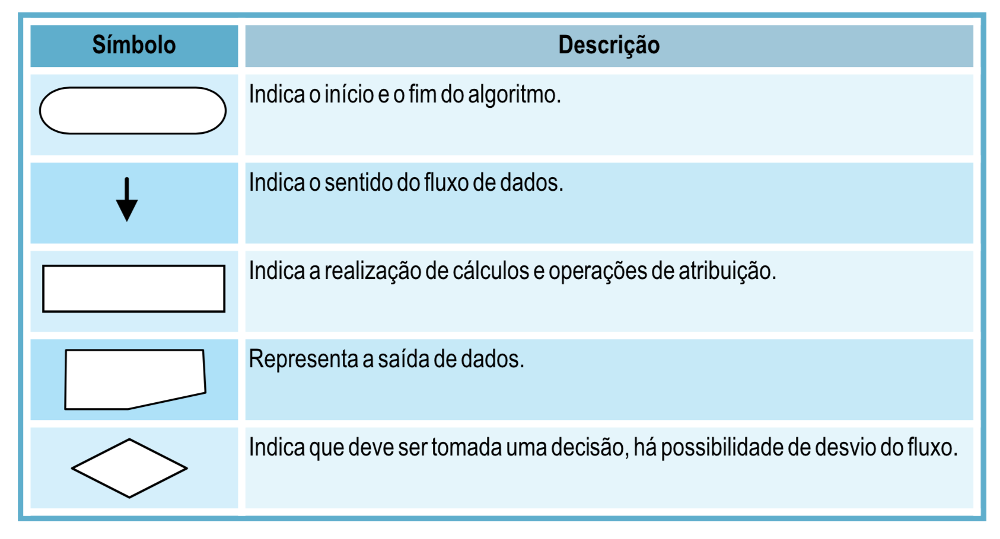
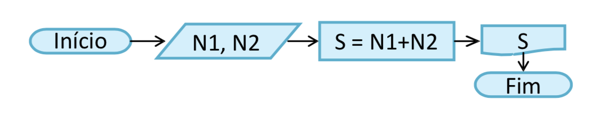

# <a name="introducao-a-logica-de-programacao">Introdução à Lógica de Programação</a>

## <a name="indice">Índice</a>

- [Introdução a Lógica de Programação](#introducao-a-logica-de-programacao)
  - [Para que serve a Lógica de Programação?](#para-que-serve-a-logica-de-programacao)
  - [Conceituando algoritmos](#conceituando-algoritmos)
    - [Problemas e soluções](#problemas-e-solucoes)
    - [Como construir algoritmos](#como-construir-algoritmos)
    - [Desenvolvendo algoritmos](#desenvolvendo-algoritmos)
      - [Descrição Narrativa](#descricao-narrativa)
      - [Fluxograma](#fluxograma)
      - [Pseudocódigo](#pseudocodigo)
  - [Exercícios](#exercicios)

## <a name="para-que-serve-a-logica-de-programacao">1. Para que serve a Lógica de Programação?</a>

A programação permite instruir o computador para que ele realize as tarefas
que desejamos, como por exemplo: controlar o estoque de uma empresa, simular
os cenários de um jogo, escrever e enviar uma mensagem em uma rede social
ou exibir imagens em uma tela.

Os computadores precisam de programas para fazer com que seus componentes
eletrônicos processem os dados e realizem os resultados que desejamos, se não,
seriam apenas um amontoado de peças que não serviriam para nada.


A programação de computadores ocorre de forma diferente da que um ser humano
utiliza para instruir outro ser humano. Esta forma envolve a lógica de programação
e poderá ser expressa de várias maneiras. Utilizaremos a forma algorítmica,
onde as instruções que o computador deve executar são codificadas em forma de
texto, com comandos escritos na língua portuguesa (portugol). Você aprenderá os
princípios e as principais estruturas que regem a programação. Realizando os
exercícios adequadamente, o seu raciocínio estará preparado para criar qualquer
tipo de programa, quando posteriormente aprender uma linguagem de programação
específica para computação.

**[voltar ao topo](#indice)**

## <a name="conceituando-algoritmos">2. Conceituando algoritmos</a>

Um algoritmo consiste em uma sequência finita de passos (instruções) para solucionar
um problema. Podemos ter vários algoritmos que resolvem um mesmo problema, desta forma
um algoritmo não é a única solução de um problema.

Os algoritmos constituem o conceito central da programação e a atividade de programar
envolve a construção de algoritmos.

Um algoritmo é um caminho para a solução de um problema, visto que podem existir
diversos caminhos que conduzem à solução.

Ao resolver algoritmos vamos construindo a nossa própria lógica de programação.
Não há receita mágica e o aprendizado de algoritmos requer prática.

Se pararmos um pouco para pensar, em nosso cotidiano encontramos uma série de
problemas os quais demandam por uma solução. E um algoritmo nada mais é do que
um conjunto de passos que resolvem um determinado problema. Isto quer dizer
já conhecemos diversos algoritmos.

**[voltar ao topo](#indice)**

### <a name="problemas-e-solucoes">2.1. Problemas e soluções</a>

Vamos supor que temos que pregar um prego em um pedaço de madeira. Para realizar
esta tarefa teremos que segurar o prego sobre a madeira e bater com o martelo
tantas vezes quantas forem necessárias até que o prego entre por inteiro.

Uma solução para este problema seria:

```
Repetir a seguinte sequência de ações:

- segurar o prego sobre a madeira com a mão esquerda
- bater com o martelo no prego, com a mão direita
- verificar se o prego já está todo dentro da madeira
```

Podemos notar nesse exemplo eque haverá uma repetição de ações até que uma
determinada condição esteja satisfeita (o prego esteja dentro da madeira).

Supomos que precisamos realizar uma seleção de candidatos para um emprego e
há dois requisitos a serem preenchidos. Nós contrataremos os que preencherem
os dois requisitos, anotaremos os dados de quem preencher apenas um dos requisitos e
dispensaremos os que não preencherem nenhum dos dois requisitos.

Poderíamos escrever uma solução para este problema da seguinte forma:

```
- chamar o candidato;
- se preencher os dois requisitos então contratar;
- caso contrário, se preenche um ou outro requisito então anotar seus dados;
- senão dispensá-lo.
```

Imaginem o seguinte problema, queremos fazer uma pizza de presunto e mussarela,
para resolver este problema precisamos primeiro definir quais serão os passos
para a resolução deste problema:

```
- Preparar a massa
- Passar molho de tomate
- Adicionar o presunto
- Adicionar a mussarela
- Adicionar o orégano
- Adicionar azeitona
- Deixar o fogão aceso por 15 minutos
- Colocar a pizza no forno
- Esperar ela ficar no ponto ideal para servir
- Remover do forno
- Cortar do jeito desejado
- Se servir
```

Pronto, definimos o passo-a-passo de desenvolvimento de uma pizza, agora podemos
observar que se alterarmos a ordem descritas o resultado pode não ser algo que
lembre uma pizza. Imagine se primeiro adicionarmos ao forno apenas a mussarela,
presunto e molho e depois de 15 minutos adicionar a massa, tirar do forno e colocar
o orégano, se servir e por ai vai até completar os demais passos, isso não vai ser
uma pizza e sim uma gororoba. Então podemos afirmar que um passo-a-passo é um
algoritmo, sendo ele ou não um código de computador.

Outra coisa que podemos reparar nesta sequência é que podemos dividir nossos
passos em 3 grupos: entrada, processamento e saída.

**Entrada:** É definido como entradas em algoritmo toda informação que sem ela não
se consegue obter o resultado desejado, no exemplo da pizza, as nossas entradas
seriam os ingredientes pois sem eles não é possível concretizar a pizza.

```
- Preparar a massa
- Passar molho de tomate
- Adicionar o presunto
- Adicionar a mussarela
- Adicionar o orégano
- Adicionar azeitona
```

**Processamento:** É definido como processamento em algoritmo todas as vezes que
utilizamos os dados de entrada para modificar ou criar novos valores, tornando
possível a criação do resultado final desejado. No exemplo da pizza, só ter os
ingredientes (nossas entradas) não faz com que se transforme em pizza, então todos
os passo que foram utilizados para misturar ou juntar os ingredientes e colocá-los
no forno são nossos processamentos.

```
- Deixar o fogão aceso por 15 minutos
- Colocar a pizza no forno
- Esperar ela ficar no ponto ideal para servir
```

**Saída:** É definido como saída em algoritmo sempre que obtivermos o resultado
final. No exemplo da pizza é quando ela já está pronta para cortarmos e comermos.

```
- Remover do forno
- Cortar do jeito desejado
- Se servir
```

Agora que estamos mais familiarizados com o termo algoritmo podemos perceber
que eles fazem parte do nosso dia a dia, por exemplo, quando seguimos
instruções para uso de um medicamento, realizamos uma ligação telefônica,
trocamos uma lâmpada, montamos um móvel ou aparelho ou até mesmo quando
seguimos uma receita culinária.

Outro conceito importante que precisamos compreender é o de programa de computador.
Um programa nada mais é que uma sequência de instruções codificada em uma linguagem
que pode ser entendida por um computador. É a representação de um algoritmo em
uma linguagem de programação.

Para se criar os programas usamos as linguagens de programação, elas funcionam
como um intermediário entre o usuário e a máquina. Imaginem como se o usuário
fosse um arquiteto brasileiro construindo uma casa e que só fala português e
estivesse tentando falar para um funcionário o que ele tem de fazer para a casa
ficar pronta, só que seu funcionário só fala alemão, então o tradutor que pega
tudo o que o arquiteto quer em português e traduz para o funcionário em alemão
é o que chamamos de linguagem de programação.

Existem diversas linguagens de programação no mundo, vou colocar em seguida algumas
delas, umas novas outras não tão recentes assim:

- JavaScript :heart:
- PHP
- Java
- C, C++, C#
- Swift
- Kotlin
- Go
- Python
- Cobol
- Fortran
- Pascal
- Ruby

**[voltar ao topo](#indice)**

### <a name="como-construir-algoritmos">2.2. Como construir algoritmos</a>

Sabemos que a construção de algoritmos requer prática, porém devemos seguir uma
linha de raciocínio para sua concepção:

- Compreender o problema: definir qual o objetivo do algoritmo.

- Definir as informações de entrada: que informações precisamos obter do usuário.

- Definir o processamento: que cálculos devemos efetuar. É neste momento que os
  dados obtidos pela entrada serão transformados em informação útil para o usuário.

- Definir as informações de saída: que informações devemos fornecer ao usuário como
  resultado do processamento efetuado.

A separação do problema em **Entrada** (Que dados devemos obter do usuário?),
**Processamento** (Que cálculos devemos efetuar?) e **Saída** (Que informações
devemos fornecer ao usuário?) nos auxilia no processo de construção do raciocínio lógico.

**[voltar ao topo](#indice)**

### <a name="desenvolvendo-algoritmos">2.3. Desenvolvendo algoritmos</a>

Existem basicamente 3 formas de se desenvolver um algoritmo que são:
Descrição Narrativa, Fluxograma e Pseudocódigo.

**[voltar ao topo](#indice)**

#### <a name="descricao-narrativa">2.3.1. Descrição Narrativa</a>

A descrição narrativa consiste na representação do problema por meio da linguagem natural,
descrevendo os passos que devem ser seguidos para a resolução de um problema.

Vamos construir um algoritmo que realize a soma de dois números:

- **Objetivo:** somar dois números.
- **Dados de entrada:** obter do usuário quais são os dois números que devemos somar.
- **Processamento:** efetuar a operação de soma com os dois números obtidos.
- **Saída:** mostrar o resultado da soma.

Agora que estruturamos o nosso problema em **Entrada – Processamento – Saída** fica mais
fácil construir o nosso algoritmo.

```
- Obter dois números
- Somar os dois números
- Mostrar o resultado da soma
```

Relembrando o exemplo da pizza, uma descrição narrativa dela seria:

Primeiro prepare a massa, passe molho de tomate por cima da massa já pré-assada de maneira
uniforme, em seguida lance por cima do molho o presunto cortado em fatias ou moído até se
sentir por satisfeito com a quantidade, faça o mesmo com a mussarela em fatias ou moída,
não se esqueça o orégano e as azeitonas (verdes ou pretas) a seu gosto. Pré-aqueça o
fogão por 15 minutos em fogo alto, abaixe a temperatura para médio ou baixo e coloque a
pizza para assar, neste momento fique observando esporadicamente o forno até estar no ponto
ideal para ser servida, com cuidado para não queimar a mão remova-a do forno cortando-a como
desejar e bom apetite, está pronto para ser servida.

Um dos problemas em se utilizar a forma de descrição narrativa é que se escreve muito para se
falar pouca coisa e por se tratar de um texto, está sujeito a ser impreciso, esquecer alguma
etapa do processo e consequentemente não dar certo. Outro problema é no fato de obrigar o
usuário a ler o texto faz com que demore mais para entender as etapas do processo e o seu
relacionamento entre as etapas, enquanto nos outros modelos esta informação é passada de uma
maneira mais visual e consequentemente mais rápida.

**[voltar ao topo](#indice)**

#### <a name="fluxograma">2.3.2. Fluxograma</a>

Usa símbolos universais que nos ajudarão a entender o que o algoritmo que dizer. O bom deles
é que por ser um padrão universal, fluxogramas escritos por programadores brasileiros poder
ser lidos e entendidos por programadores alemães, franceses, italianos, americanos e todos vão
conseguir entender o que está acontecendo com o programa e qual o resultado final do
mesmo.

Normalmente, antes de escrevermos um programa em uma das diversas linguagens de programação
existentes, usamos o fluxograma para esboçar o programa para em seguida transformarmos ele
pronto em um código que pode ser rodado em uma máquina.

Um ponto fraco do fluxograma é que ele se torna muito complicado a partir do momento em que seu
programa vai crescendo mas ainda é aconselhado a utilização do mesmo como ferramenta na
criação de seus programas.



Para melhor compreensão, fluxograma abaixo representa o algoritmo de somar dois números.



**[voltar ao topo](#indice)**

#### <a name="pseudocodigo">2.3.3. Pseudocódigo</a>

CRIAR DESCRIÇÃO DO PSEUDOCÓDIGO, REVISAR ORTOGRAFIA, ACRESCENTAR LINKS DE NAVEGAÇÃO
ADICIONAR IMAGENS, ACRESCENTAR LINKS IMPORTANTES NO README

**[voltar ao topo](#indice)**

## <a name="exercicios">Exercícios</a>

1.  Descreva quais os passos e separe-os em entrada, processamento e saída para:

    - Trocar o pneu de um carro;
    - Tomar banho;
    - Fazer um bolo;
    - Somar dois números;

2.  No subcapítulo 2.1. foi colocado uma lista com as linguagens de programação,
    pesquise sobre elas e informe o ano de surgimento de cada uma delas e para que são
    utilizadas.

3.  Faça uma descrição narrativa de escovar seus dentes, atravessar uma rua e acessar um site.

4.  Faça o mesmo do exercício 3, mas agora utilize fluxogramas.

**[voltar ao topo](#indice)**
