# <a name="construindo-os-primeiros-algoritmos">Construindo os primeiros algoritmos</a>

Para entender a construção de algoritmos, vamos iniciar estudando alguns conceitos básicos
como variáveis e constantes.

## Índice

- [Construindo os primeiros algoritmos](#construindo-os-primeiros-algoritmos)
	- [Estudando variáveis](#estudando-variaveis)
		- [Por que declarar variáveis e como nomeá-las?](#por-que-declarar-variaveis-e-como-nomea-las)
		- [O que são tipos de variáveis?](#o-que-sao-tipos-de-variaveis)
	- [Constantes](#constantes)
	- [Comandos de atribuição, entrada e saída de dados](#comandos-de-atribuicao-entrada-e-saida-de-dados)
		- [Comandos de Atribuição](#comandos-de-atribuicao)
		- [Comando de Entrada de Dados](#comando-de-entrada-de-dados)
		- [Comando de Saída de Dados](#comando-de-saida-de-dados)
	- [Expressões](#expressoes)
		- [Operadores aritméticos](#operadores-aritimeticos)
		- [Operadores Relacionais](#operadores-relacionais)
		- [Operadores Lógicos](#operadores-logicos)
		- [Expressões Lógicas](#expressoes-logicas)
	- [Exercícios](#exercicios)

## <a name="estudando-variaveis">Estudando variáveis</a>

Ao desenvolvermos nossos algoritmos, frequentemente precisamos armazenar dados referentes ao
problema, como um nome, um número ou mesmo o resultado de uma operação. Mas, para armazenar
esses dados, precisamos solicitar ao computador que ele reserve uma área da memória para
nosso uso. A forma de solicitar ao computador que reserve memória é chamada de declaração
de variáveis. Uma variável é um espaço na memória do computador que pode conter
diferentes valores a cada instante de tempo.

Uma variável pode ser vista como uma caixa que armazena pertences. Esta caixa tem um nome e
somente guarda objetos do mesmo tipo. Uma variável possui um nome e seu conteúdo pode ser de
vários tipos: inteiro, real, caractere, lógico entre outros.

Supomos que temos uma variável com nome `idade`. Essa variável pode guardar apenas valores
inteiros. Com isto, temos que o valor `casa` não pode ser armazenado nesta caixa, visto
que se trata de um conjunto de caracteres.

Em um algoritmo o conteúdo de uma variável pode ser modificado, consultado ou apagado quantas
vezes forem necessárias, porém é importante ter ciência de que a variável armazena apenas um conteúdo por vez.

### <a name="por-que-declarar-variaveis-e-como-nomea-las">Por que declarar variáveis e como nomeá-las?</a>

Sempre que criamos uma variável, nós o fazemos com o objetivo de armazenar algum tipo de
valor específico. Por exemplo, se estivermos desenvolvendo um algoritmo que calcule o imposto
de renda a ser pago por um assalariado, precisaremos de variáveis para armazenar o valor do
salário, bem como para armazenar os resultados dos cálculos. Assim, o nome dado à variável
deve deixar claro o objetivo da mesma, ou seja, devemos utilizar nomes sugestivos.

Apesar de esta ser a principal diretriz quanto à atribuição de nomes a variáveis, algumas
outras regras são apresentadas a seguir:

- O nome deve iniciar SEMPRE com letra. Isto indica que nossas variáveis podem ser chamadas de
media, altura, idade, cidade. Mas, não pode ser 2cidade, 4x etc.

- O nome não pode conter espaços, ou seja, não podemos denominar uma variável de altura
media.

- O nome não pode conter caracteres especiais ($, #, @, ?, !, *).

- Nenhuma palavra reservada poderá ser nome de variável. As palavras reservadas têm uso
específico no pseudocódigo. Alguns exemplos são: Var, tipo, início, fim, se, então, senão,
enquanto, repita, faça, caso, até, procedimento, função e outros. Não se assuste com
todos esses termos, iremos vê-los no decorrer do curso e com a prática logo você estará
familiarizado com todos eles.

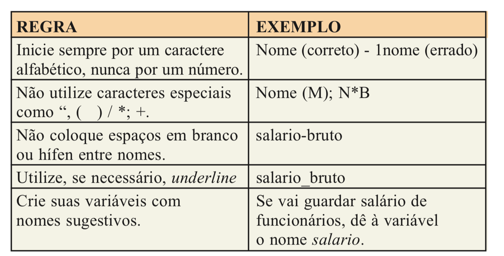

Em visualg as variáveis são definidas logo no início do algoritmo para que a área na
memória seja alocada. A definição de variáveis é realizada utilizando a palavra
reservada `Var`, primeiro definimos o nome e, em seguida, o tipo, do seguinte modo:

```
Var
  <nome da variável> : <tipo da variável>
```

Ao declarar variáveis devemos tomar alguns cuidados: a palavra `Var` é usada uma única vez na
definição de variáveis; mais de uma variável do mesmo tipo pode ser definida em uma mesma
linha, basta separar cada uma delas por vírgula; e, se há diferentes tipos de variáveis,
cada tipo deve ser declarado em linhas diferentes.

### <a name="o-que-sao-tipos-de-variaveis">O que são tipos de variáveis?</a>

Quando declaramos uma variável, devemos ter em mente os valores que serão armazenados naquele
espaço de memória. É essa observação que definirá o tipo da variável a ser declarado.
Uma variável pode ser de um dos seguintes tipos:

- ***Tipo inteiro***: Declararemos variáveis do tipo numérico inteiro quando precisarmos
  armazenar valores inteiros, positivos ou negativos (1, 5, 7, -10, -5, ...). Por exemplo, se
  precisarmos de uma variável para armazenar o número de filhos de um funcionário, o tipo
  ideal para essa variável seria inteiro. Uma variável inteira armazena dados numéricos que
  não possuem componentes decimais ou fracionários. A declaração de uma variável do tipo
  inteiro é realizada da seguinte forma:

  ```
  Var
    idade: inteiro
  ```

- ***Tipo real***: Declararemos variáveis do tipo numérico real para armazenar valores reais,
  em outras palavras, valores com ponto decimal (5.7, 3.2, -8.5). Esse seria o tipo ideal para
  armazenar, por exemplo, o salário de funcionários. Neste ponto você pode estar se perguntando:
	que diferença faz declarar uma variável como inteira ou real?
  A diferença está no tamanho do espaço de memória utilizado. Normalmente, uma variável inteira
	pode ocupar 1, 2 ou 4 bytes. Enquanto uma variável real poderá ocupar 4 ou 8 bytes. Isto nos
	indica que se alocarmos todas as variáveis como real, estaremos alocando um espaço
  de memória desnecessário. A declaração de uma variável do tipo real é realizada da seguinte forma:

  ```
  Var
    salario: real
  ```

- ***Tipo caractere***: Declararemos variáveis do tipo caractere cadeia para armazenar uma
  sequência de caracteres, ou seja, uma palavra, uma mensagem, um nome. Assim, se precisarmos
  de uma variável para armazenar o nome de uma pessoa, esse seria o tipo ideal. A declaração
	de uma variável do tipo caractere é realizada da seguinte forma:

  ```
  Var
    nome: caractere
  ```

- ***Tipo lógico***: Declararemos variáveis do tipo lógico para armazenar valores lógicos,
	ou seja, o valor de variáveis desse tipo será sempre VERDADEIRO ou FALSO.

  ```
  Var
    ocupado: logico
  ```

## <a name="constantes">Constantes</a>

Como aprendemos, o valor de uma variável pode ser alterado ao longo de seu algoritmo. Mas, às
vezes, precisamos armazenar valores que não se alteram. Para isso existem as constantes.

Uma constante armazena informações que não variam com o tempo, ou seja, o seu conteúdo é
um valor fixo. Da mesma forma que as variáveis, todas as constantes devem ser definidas no
início do algoritmo, literalmente acima das variáveis caso existam. O comando utilizado para
definir constantes é o CONST e sua definição é dada por:

```
Const
  <nome da constante> = <valor>
```

Como exemplo, considere um algoritmo que calcule o valor da contribuição do FGTS: 8% sobre o
salário, independentemente do valor do salário. Assim, a taxa de 8% será constante durante a
execução do programa. Logo, poderia declarar a constante da seguinte forma:

```
Const
  TAXA_FGTS = 0.08;
```

## <a name="comandos-de-atribuicao-entrada-e-saida-de-dados">Comandos de atribuição, entrada e saída de dados</a>

### <a name="comandos-de-atribuicao">Comandos de Atribuição</a>

Na construção de algoritmos, depois que declaramos nossas variáveis e constantes, geralmente
precisamos indicar que elas armazenarão um determinado valor durante a execução do programa.
Para isso, utilizamos o comando de atribuição que, em Portugol, é representado por uma seta (<-),
conforme sintaxe abaixo:

```
// Código omitido
Var
  nota: inteiro
  sexo: caractere

// Código omitido

// atribuímos o valor 10 à variável nota
nota <- 10

// atribuímos o caractere "F" à variável sexo
sexo <- "F"
```

A atribuição consiste no processo de fornecer um valor a uma variável, em que o tipo desse
valor tem que ser compatível com a variável.

A leitura das instruções acima é realizada do seguinte modo: a variável nota recebe o valor 10,
a variável sexo recebe o valor "F".

### <a name="comando-de-entrada-de-dados">Comando de Entrada de Dados</a>

Frequentemente, na construção de algoritmos, precisamos solicitar que usuários informem, por
meio do teclado, alguns valores a serem utilizados durante a execução. Por exemplo, se
fizermos um algoritmo para calcular a média das notas de um aluno, precisaremos solicitar
quais foram as notas, para depois calcularmos a média. Esses valores informados devem ser armazenados
em variáveis para que sejam utilizados quando necessário.

A entrada de dados permite receber os dados digitados pelo usuário e é realizada por meio do
comando leia. Os dados recebidos são armazenados em variáveis. Ao utilizarmos esse comando o
computador fica "aguardando" uma ação do usuário, que é digitar o valor para a variável.
A sintaxe do comando é:

```
Leia(variavel)
```

### <a name="comando-de-saida-de-dados">Comando de Saída de Dados</a>

A saída de dados permite mostrar dados aos usuários. O comando utilizado é o escreva, que
busca as informações na memória e posteriormente as disponibiliza por meio de um
dispositivo de saída (monitor ou impressora). A sintaxe do comando de saída é:

```
Escreva("Olá mundo!")
```

Com o comando de saída podemos enviar mensagens ao usuário, informando que ação estamos
esperando ou enviar resultados dos dados processados. Podemos imprimir diversas variáveis ou
combinar variáveis com literais em um único comando, basta separá-las por vírgula. Por
exemplo:

```
Escreva("A idade é:", idade)
Escreva(n1, "x", n2, "é igual a", produto)
```

## <a name="expressoes">Expressões</a>

As expressões estão diretamente relacionadas ao conceito de fórmula matemática, em que um
conjunto de variáveis e constantes relaciona-se por meio de operadores. As expressões dividem-se em:
 aritméticas, relacional, lógicas e literais.

### <a name="operadores-aritimeticos">Operadores aritméticos</a>

Os operadores aritméticos são símbolos que representam operações aritméticas, ou seja, as operações matemáticas básicas. Abaixo é apresentada uma tabela contendo os operadores aritméticos que utilizaremos neste curso,
destacando suas representações, forma de uso e
prioridade. A prioridade entre operadores define a ordem em que os mesmos devem ser avaliados
dentro de uma mesma expressão.

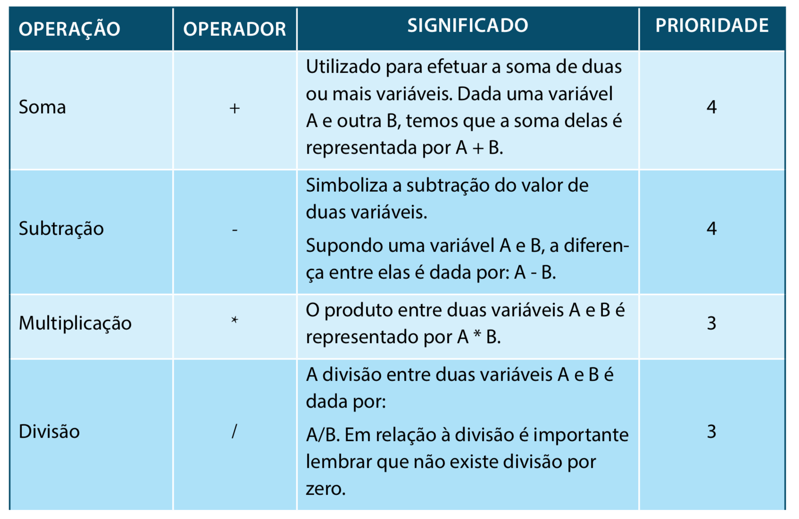
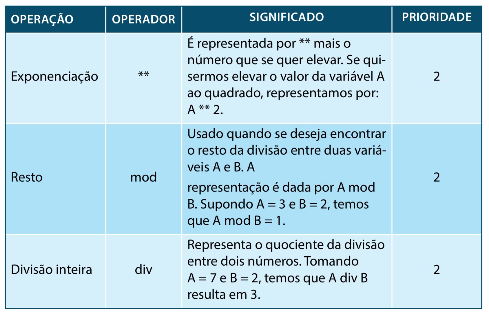

Além da ordem de prioridades definida acima, podemos utilizar parênteses. Assim, resolvemos
primeiro as expressões contidas nos parênteses mais internos, seguindo a ordem de
precedência entre operadores, passando depois para os parênteses mais externos. Por exemplo,
na expressão:

```
nota1 + (nota2 + nota3) / 2
```

**Primeiro somamos nota2 a nota3; o resultado é divido por 2 e só depois somamos com nota 1.**

Um fato interessante é que o resultado da execução de expressões aritméticas é sempre um
valor numérico (inteiro ou real) que pode então ser atribuído a uma variável numérica
através do uso do comando de atribuição estudado anteriormente.

Como exemplo, vamos criar um algoritmo para ler e multiplicar dois números inteiros e exibir o
resultado.

```
Algoritmo "multiplicacao"
Var
  num1, num2, mult: inteiro
Inicio

// entrada
Escreva("Digite o primeiro número: ")
Leia(num1)
Escreva("Digite o segundo número: ")
Leia(num2)

// processamento
mult <- num1 * num2;

// saída
Escreva("O resultado da multiplicação é: ", mult)
Fimalgoritmo
```

Vamos entender todas as linhas do nosso algoritmo:

```
Linha 1     - Nome do programa.

Linha 2 e 3 - Declaração das três variáveis do tipo inteiro necessárias ao programa.

Linha 4     - Indica o início do programa.

Linha 7     - O comando escreva exibirá a mensagem que solicita a digitação do primeiro número.

Linha 8     - O primeiro número digitado será lido e armazenado na variável num1.

Linha 9     - O comando escreva exibirá a mensagem que solicita a digitação do segundo número.

Linha 10    - O segundo número digitado será lido e armazenado na variável num2.

Linha 13    - A variável MULT receberá o resultado da multiplicação do primeiro pelo segundo número.

Linha 16    - O comando escreva exibirá uma mensagem com o resultado da multiplicação.

Linha 17    - Indica o fim do programa.
```

### <a name="operadores-relacionais">Operadores Relacionais</a>

Os operadores relacionais são utilizados para realizar comparações entre dois valores
de um mesmo tipo. Esses valores podem ser representados por variáveis ou constantes. Os
operadores relacionais são os seguintes:

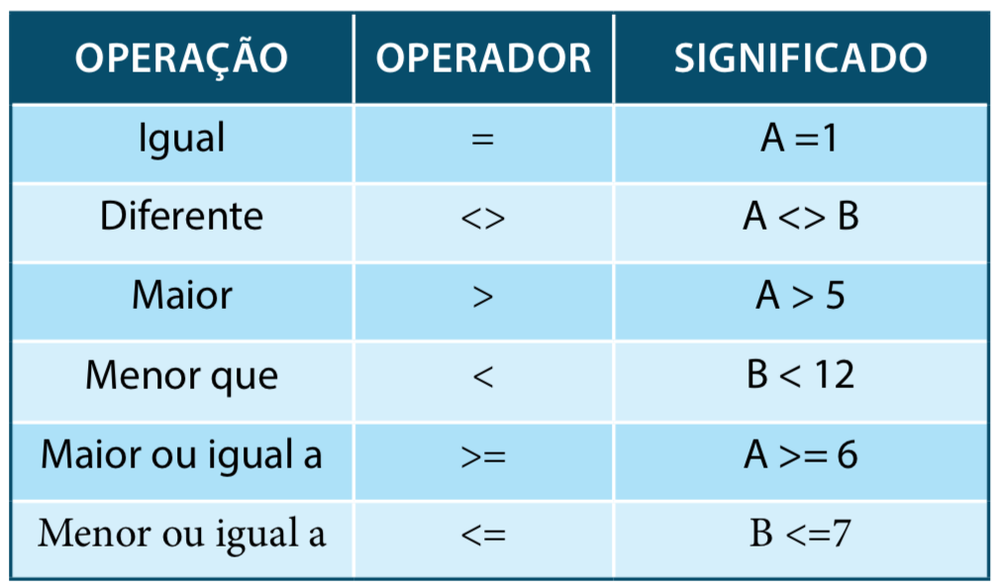

A uma comparação realizada utilizando um operador relacional se dá o nome de
relação. O resultado obtido de uma relação é sempre um valor lógico, ou seja,
verdadeiro ou falso.

Na tabela abaixo temos exemplos de relações e seus resultados. Para tais exemplos, considere duas
variáveis inteiras, A e B onde A=5 e B=8:

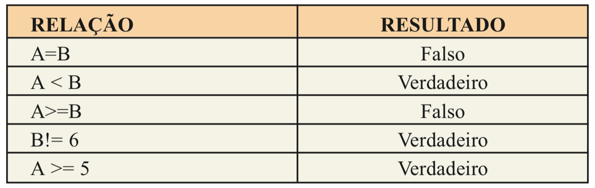

### <a name="operadores-logicos">Operadores Lógicos</a>

Os operadores lógicos retornam verdadeiro ou falso de acordo com seus operandos. Os
operadores lógicos mais comuns são listados na tabela abaixo:

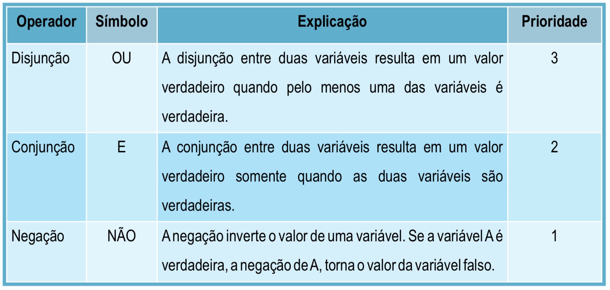

Os operadores lógicos também são conhecidos como conectivos, pois são utilizados para
formar novas proposições a partir da junção de duas outras. Para entender o
funcionamento de operadores lógicos, vamos recorrer ao nosso exemplo das variáveis
inteiras, A e B onde A=5 e B=8:

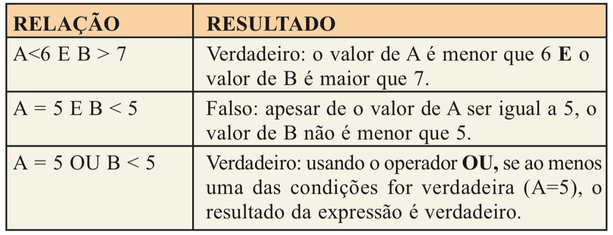

Para visualizar todas as opções possíveis ao utilizar operadores lógicos, utilizamos
as tabelas-verdade. As tabelas-verdade definem os resultados apresentados pelos
operadores lógicos de acordo com todas as combinações possíveis para os valores de
suas entradas.

Abaixo são apresentadas as tabelas-verdade para os 3 operadores lógicos que
utilizaremos (OU, E e NÃO) para duas proposições (ou expressões) P e Q.

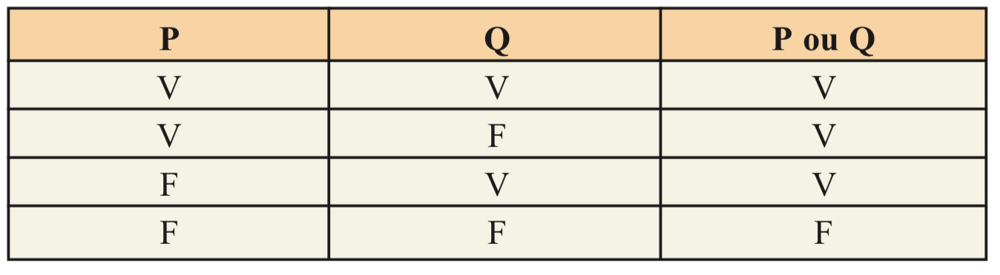

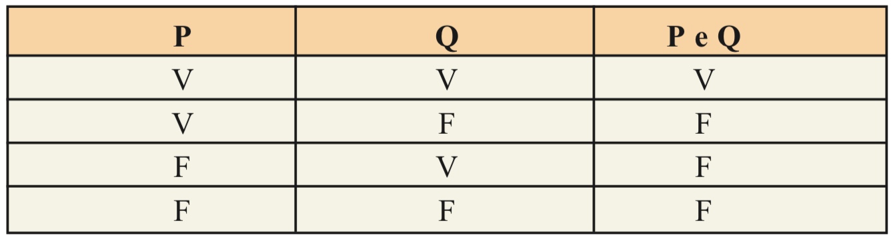

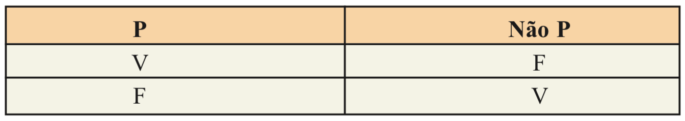

### <a name="expressoes-logicas">Expressões Lógicas</a>

As expressões lógicas são expressões formadas a partir do uso de variáveis e constantes,
operadores relacionais e operadores lógicos. As expressões lógicas são avaliadas e retornam
sempre um valor lógico: verdadeiro ou falso.

**Exemplos:**

```
  (x < y) e (y < z)
  (y + z < x) ou (x>10) e (y < 5)
```

## <a name="exercicios">Exercícios</a>

1. Faça um algoritmo que solicite que o usuário digite seu nome e a seguir solicite que
seja digitada sua idade. Depois que o usuário digitar o nome e a idade, o programa deve
exibir na tela duas mensagens: uma com o nome e outra com a idade do usuário. Suponha
que o usuário seja o Pedro e tenha 32 anos. Assim, após a digitação dos dados, seu
programa deve exibir as seguintes mensagens: “Seu nome é Pedro” e “Você tem 32 anos”.

2. Elabore um algoritmo que leia um número inteiro e apresente o antecessor, o número e o sucessor.

3. Elabore um algoritmo que leia um número inteiro e apresente a raiz quadrada e o valor deste número elevado ao quadrado.

4. Elabore um algoritmo que leia, calcule e escreva a média aritmética entre quatro números.

5. Escreva um algoritmo que calcule a área de um triângulo.

6. Escreva um algoritmo que calcule a área e o perímetro de um círculo.

7. Corrija o algoritmo abaixo:

    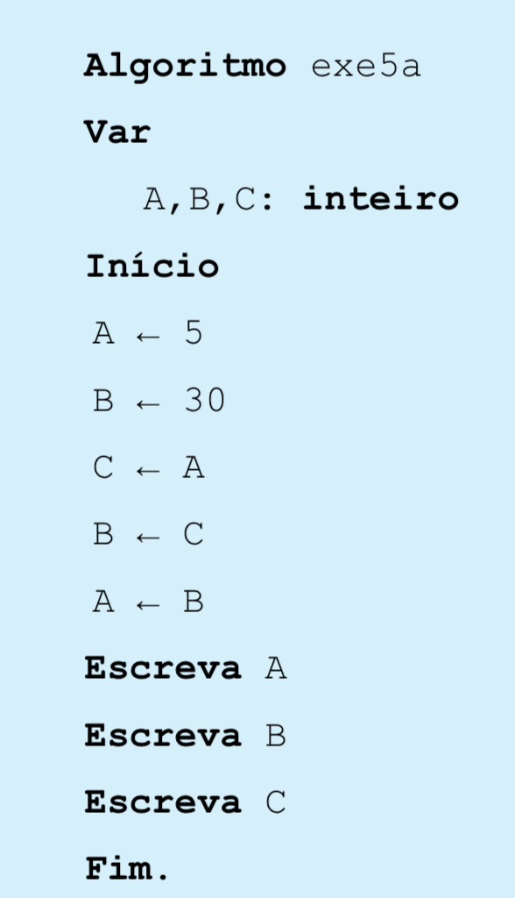

8. Construa um algoritmo que leia o preço de um produto, o percentual de desconto e calcule
o valor a pagar e o valor do desconto.

9. Faça um algoritmo que calcule o salário líquido de um funcionário, considerando que sobre
 o seu salário bruto, incide um desconto de 10% para previdência. O algoritmo deve mostrar
 o nome do funcionário, o seu salário bruto e o seu salário líquido.

10. Faça um programa que calcula os gastos com combustível em uma viagem. O programa deve
solicitar ao usuário a distância a ser percorrida em Km, o consumo do carro em Km/litro e
o preço do litro do combustível. Como resposta o programa deverá informar qual o valor em
R$ a ser gasto com combustível na viagem.

