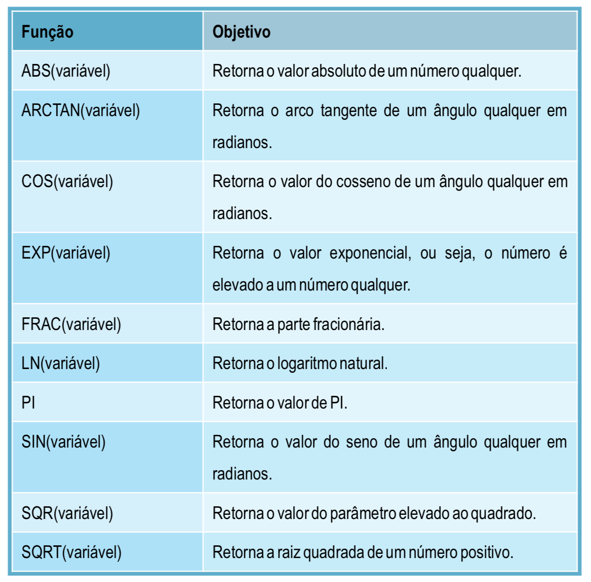
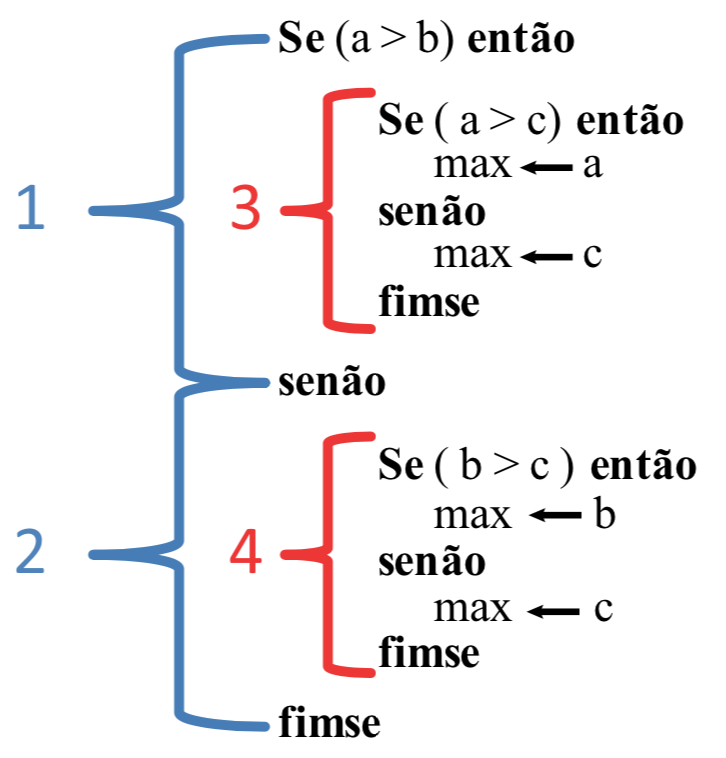
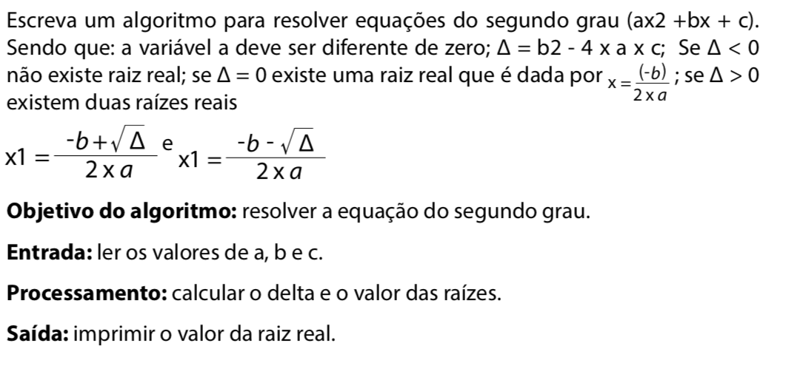

# <a name="avancando">Avançando</a>

## Índice

- [Avançando](#avancando)
  - [Funções intrínsecas](#funcoes-intrinsecas)
  - [Estrutura condicional](#estrutura-condicional)
    - [Estrutura condicional simples](#estrutura-condicional-simples)
    - [Estrutura condicional composta](#estrutura-condicional-composta)
    - [Estrutura condicional aninhada](#estrutura-condicional-aninhada)
  - [Exercícios](#exercicios)
  - [Desafio](#desafio)

## <a name="funcoes-intrinsecas">Funções intrínsecas</a>

As funções intrinsecas são fórmulas matemáticas prontas que podemos
utilizar em nossos algoritmos.



## <a name="estrutura-condicional">Estrutura condicional</a>

Até o momento, os nossos algoritmos apresentavam um padrão em que a
partir dos dados de entrada, esses eram processados e na saída
mostrávamos algumas informações. O fluxo era seguido sequencialmente,
sem nenhum desvio, ou seja, todas as instruções eram executadas. No
entanto, em muitas situações necessitamos realizar algum teste antes
de efetuar um processamento.

Vamos analisar a retirada de dinheiro em um caixa eletrônico. Após
inserir o cartão é solicitado que a senha seja digitada. Se a senha
digitada estiver correta poderemos efetuar o saque. Caso a senha esteja
errada receberemos mensagem informando que a senha é inválida. Notem
que nesta situação não conseguimos representar apenas com o
conhecimento adquirido até aqui. Em situações como esta precisamos
utilizar uma estrutura que nos permita fazer verificações para então
saber que instruções devem ser executadas.

A estrutura que permite desviar o fluxo do programa é denominada de
estrutura condicional, estrutura de seleção ou estrutura de controle.

A estrutura condicional consiste em uma estrutura de controle de fluxo
que permite executar um ou mais comandos se a condição testada for
verdadeira ou executar um ou mais comandos se for falsa. Essa estrutura
divide-se em estrutura simples e estrutura composta, as quais veremos a seguir.

### <a name="estrutura-condicional-simples">Estrutura condicional simples</a>

Na estrutura condicional simples o comando só será executado se a condição for verdadeira. A sintaxe do comando é:

```
se (<Condição>) entao
	<instruções para condição verdadeira>
fimse
```

A estrutura condicional simples tem por finalidade tomar uma decisão. De
modo que se a condição que está sendo testada for verdadeira são
executadas todas as instruções compreendidas entre o `se` e o `fimse`.
Ao término da execução o algoritmo segue o primeiro comando após o `fimse`. Se a condição que está sendo testada for falsa o algoritmo
executa a primeira instrução após o `fimse`, não executando as
instruções compreendidas entre o `se` e o `fimse`.

Vamos analisar o algoritmo apresentado abaixo. Consideremos o valor de `A` como `15`, desta forma ao testar a condição dada pela expressão `A > 10`, retorna um valor verdadeiro. Com isto, temos a execução do
comando escreva que está compreendido entre o `se` e o `fimse`. Agora, tomemos `A` com valor `3`. Ao testar a condição `A > 10` o valor retornado é falso. Deste modo, não é executada a instrução entre o `se` e o `fimse`.

```
Algoritmo "exemplo"
Var
   A : inteiro
Inicio

  Leia(A)

  se (A > 10) entao
    Escreva ("A é maior que 10")
  fimse

Fimalgoritmo
```

A condição é uma expressão lógica, portanto ao ser testada devolve
como resposta o valor verdadeiro ou falso. Uma condição pode ser
representada por uma expressão relacional ou por uma expresão lógica
formada por pelo menos duas expressões relacionais. Os operadores
relacionais vistos na anteriormente são `>, <, =, >=, <= e <>`. Já os operadores lógicos são `E, OU e NAO`.

Agora fica mais clara a aplicação dos operadores relacionais e como
eles são utilizados em nossos algoritmos. Alguns exemplos de expressão
relacional são:

```
X > 16
A < B
Sexo = "F"
Resposta <> "Sim"
```

Quando nossa condição é uma expressão lógica temos pelo menos duas
expressões relacionais que estão ligadas por um operador lógico. Você
se recorda do funcionamento dos operadores lógicos? O operador `E`
resulta em verdadeiro somente quando as duas condições são verdadeiras. O operador `OU` resulta em verdadeiro quando pelo menos uma
das condições é verdadeira. E o operador `NAO` funciona como a negação do resultado, ou seja, inverte o resultado lógico. Vamos ver exemplos de expressão lógica:

```
(X >= 1) E (X <=20)
(Sexo = "F") OU (Sexo = "f")
NAO (X>5)
```

Note que as expressões lógicas são compostas utilizando operadores relacionais e lógicos.

Agora que conhecemos a sintaxe da estrutura condicional simples e sabemos
como montar condições, vamos formular nosso primeiro algoritmo contendo
desvio de fluxo.

O problema consiste em identificar se um número inteiro é um número
par e então imprimir a metade do número.

O que é um número par? Um número par é um número inteiro múltiplo
de 2, ou seja, um número cuja divisão por 2 resulte em resto igual a 0.

A entrada de dados consiste em obter um número inteiro, o qual denominaremos de N. O processamento consiste em encontrar o resto da
divisão deste número por 2 e verificar se é igual a zero. Como faremos isso? Você se recorda de alguma função que faz isso? Acima vimos o
operador MOD, que retorna o resto da divisão de dois números inteiros.

Se o resto for igual a zero calcularemos a metade deste número. E a saída consistirá em imprimir a metade do número. Se o resto for diferente de zero não será executada nenhuma instrução e também não
haverá saída.


```
Algoritmo "exemplo2"
Var
   n, resto: inteiro
   metade: real
Inicio


    Escreva("Digite um número: ")
    Leia(n)

    resto <- n mod 2
    // ou resto <- n mod(2)

    se (resto = 0) entao

         metade <- n / 2

         Escreva("A metade do número: ", metade)

      fimse

Fimalgoritmo
```

Neste algoritmo utilizamos os conceitos que já conhecíamos (variáveis,
tipos de variáveis, atribuição, comando de entrada e saída de dados),
agregando a estrutura condicional.

Em relação ao algoritmo apresentado, podemos colocar uma instrução
`escreva` após o `fimse` dizendo que o número é ímpar? Não, pois para qualquer número obtido na entrada, indiferente de ser par ou ímpar,a mensagem seria impressa. Devemos lembrar que após o `fimse` o fluxo do
algoritmo segue normalmente, sendo executada instrução a instrução.

Por que a variável `metade` foi declarada como `real`?  Se a instrução que calcula a metade fosse executada fora da estrutura condicional a variável deve  ser do tipo `real`. Por exemplo, se o número 3 fosse obtido na entrada a metade seria 1.5, que não é um número inteiro.

Precisamos dessa variável denominada metade? E a variável resto? Não,
podemos realizar o teste lógico a partir da expressão relacional, não
sendo necessária a variável metade. Quanto a variável resto, podemos
enviar como saída a operação que calcula a metade. Com isto, teríamos
um algoritmo que utiliza apenas uma variável e duas operações de
atribuição menos, como pode ser visto abaixo.

```
Algoritmo "exemplo3"
Var
   n: inteiro
Inicio


      Escreva("Digite um número: ")
      Leia(n)

      se (n mod 2 = 0) entao

         Escreva("A metade do número: ", n/2)

      fimse

Fimalgoritmo
```

### <a name="estrutura-condicional-composta">Estrutura condicional composta</a>

Na estrutura condicional composta é realizada a avaliação de uma
única expressão lógica. Se o resultado desta avaliação for
verdadeiro é executado a instrução ou o conjunto de instruções compreendido entre o comando `se` e o `senao`. Se o resultado da avaliação for falso é executado a instrução ou o conjunto de instru- ções entre o `senao` e o `fimse`.

```
se (<Condição>) entao
	<instruções para condição verdadeira>
senao
	<instruções para condição falsa>
fimse
```

Agora que você conhece a estrutura condicional composta, podemos
construir um algoritmo para verificar se um número inteiro é par ou ímpar.

```
Algoritmo "exemplo4"
Var
   n: inteiro
Inicio


    Escreva("Digite um número: ")
    Leia(n)

    se (n mod 2 = 0) entao

        Escreva("O número é par")

    senao

        Escreva("O número é impar")

    fimse

Fimalgoritmo
```

Se o resultado do teste da expressão relacional `n mod 2 = 0` for
verdadeiro é executada a instrução que se encontra entre o `se` o `senao`, ou seja, escreva "o número é par". Caso o resultado do teste
seja falso é executada a instrução que se encontra em o `senão` e o `fimse`, escreve "O número é ímpar". Por exemplo, se o número obtido na entrada for 5 temos que `5 mod 2 é igual a 1`, ou seja, o teste da expressão resulta em falso, logo será impresso que "O número é ímpar".

Antes de conhecer outros tipos de estrutura condicional vamos praticar
mais a construção de algoritmos utilizando expressões lógicas. O
problema consiste em: dado um número inteiro verificar se ele está
compreendido entre 20 e 90.

```
Algoritmo "exemplo5"
Var
   n: inteiro
Inicio

      Escreva("Digite um número inteiro: ")
      Leia(n)

      se (n > 20) e (n < 90) entao
         Escreva("O número está na faixa entre 20 e 90")
      senao
           Escreva("O número está fora da faixa")
      fimse

Fimalgoritmo
```

### <a name="estrutura-condicional-aninhada">Estrutura condicional aninhada</a>

Vamos conhecer a estrutura condicional aninhada ou encadeada. Essa estrutura é utilizada quando precisamos estabelecer a verificação de
condições sucessivas, em que uma determinada ação poderá ser
executada se um conjunto anterior de instruções ou condições for
satisfeito. A execução da ação pode, também, estabelecer novas
condições. E o que isso quer dizer? Que podemos utilizar uma condição
dentro de outra, ou seja, a estrutura pode possuir diversos níveis de
condição. Essa estrutura é utilizada quando sentimos a necessidade de
tomar decisões dentro de uma das alternativas de uma condição.

Vamos visualizar a estrutura condicional aninhada em um problema que consiste em encontrar o maior número dentre três números.

**Objetivo do algoritmo:** encontrar o maior número.

**Entrada:** obter três números inteiros.

**Processamento:** comparar os números e armazenar o valor do maior.

**Saída:** imprimir o maior número.

A entrada de dados consiste em ler três números inteiros, os quais
armazenaremos em variáveis denominadas `A, B e C`. Para encontrar qual o
maior número precisamos realizar comparações utilizando expressões
relacionais do tipo: `A > B` e armazenar o valor do maior número em uma
variável, a qual chamaremos de `max`. A saída consiste em enviar uma
mensagem contendo o valor do maior número, que está armazenado na
variável `max`. O algoritmo para o problema é apresentado abaixo.

```
Algoritmo "examplo6"
Var
   a, b, c, max: inteiro
Inicio

    Escreva("Digite o primeiro numero inteiro: ")
    Leia(a)

    Escreva("Digite o segundo numero inteiro:")
    Leia(b)

    Escreva("Digite o terceiro numero inteiro:")
    Leia(c)

    Se (a > b) entao

        Se (a > c) entao
            max <- a
        Senao
            max <- c
        fimse

   senao

        Se (b > c) entao
            max <- b
        senao
            max <- c
        fimse

   fimse

   Escreva("O maior numero é:", max)

Fimalgoritmo
```

Se você não entendeu o funcionamento do algoritmo, fique tranquilo
veremos passo a passo a estrutura condicional do problema em questão.
Na figura abaixo temos a representação da estrutura condicional
aninhada, os colchetes em azul representam a estrutura condicional
composta, em que o trecho 1 é executado quando o resultado da expressão
relacional `A > B` é verdadeiro. O trecho 2 apresenta o conjunto de
instruções que é executado quando o resultado da expressão relacional
é falso. Note que tanto no trecho 1 quanto no trecho 2, temos outra
estrutura condicional, representada pelos trechos 3 e 4. A estrutura
condicional do trecho 3 só é executada se A > B resultar em verdadeiro.
Em seguida, é verificado se `A > C`, em caso verdadeiro é executada a
instrução em que é atribuído o valor de A para a variável `max`.
Se `A > C` for avaliado como falso é executada a instrução em que o valor de C é atribu-́do para a variável `max`.



## <a name="exercicios">Exercícios</a>

1. Formule um algoritmo que leia a matrícula e nome de um vendedor, seu
salário fixo e o total de vendas e calcule a comissão do vendedor. Se o
total de vendas é inferior a R$ 1500,00 o percentual de comissão é 2%
e se for maior o percentual é de 4%. Apresente o nome do vendedor,
matrícula, salário fixo e salário total.

1. Formule um algoritmo que receba dois números e mostre os seguintes resultados para o usuário:

    - A soma do primeiro pelo segundo
    - A subtração do primeiro pelo segundo
    - A divisão do primeiro pelo segundo
    - A multiplicação do primeiro pelo segundo
    - O quadrado do primeiro numero
    - A raiz quadrada do segundo numero
    - O resto da divisão do primeiro pelo segundo
    - A parte inteira da divisão do primeiro pelo segundo.

1. Formule um algoritmo que leia a temperatura em graus Celsius e apresente-a em Fahrenheit, sabendo que a formula para a conversão é F=(9*°C + 160) / 5

1. Formule um algoritmo que leia que receba 3 idade e informe qual a média das idades.

1. Formule um algoritmo que receba o valor de um produto e que calcule qual o valor daquele produto se o mesmo receber 10% de desconto.

1. Formule um algoritmo que calcule a Área de um trapézio sabendo que a formula é A=((B+b)*h)/2.

1. Escreva um algoritmo que leia um número e informe se ele é divisível por 3 e por 7.

1. Formule um algoritmo que leia cinco números e conte quantos deles são negativos.

1. Faça um Algoritmo para calcular a área de um circulo, fornecido o valor do raio, que deve ser positivo.

1. Faça um algoritmo que peça ao usuário a quantia em dinheiro que tem sobrando e sugira, caso ele tenha 10 ou mais reais, que vá ao cinema, e se não tiver, fique em casa vendo TV.

1. Um determinado clube de futebol pretende classificar seus atletas em
categorias e para isto ele contratou um programador para criar um
programa que executasse esta tarefa. Para isso o clube criou uma tabela
que continha a faixa etária do atleta e sua categoria. A tabela está
demonstrada abaixo:

    IDADE CATEGORIA

    - De 05 a 10 Infantil
    - De 11 a 15 Juvenil
    - De 16 a 20 Junior
    - De 21 a 25 Profissional

    Construa um programa que solicite o nome e a idade de um atleta e imprima a sua categoria.

1. Elabore um algoritmo que leia o percurso em quilômetros, o tipo de
moto e informe o consumo estimado de combustível, sabendo que uma moto
do tipo A faz 26 km com um litro de gasolina, uma moto do tipo B faz 20
km e o tipo C faz 7 km.

1. Construa um algoritmo que receba o nome e a idade de uma pessoa e
informe se é menor de idade, maior de idade ou idoso.

1. Elabore um algoritmo que receba a idade de uma pessoa e identifique
sua classe eleitoral: não eleitor (menor que 16 anos de idade), eleitor
obrigatório (entre 18 e 65 anos) e eleitor facultativo (entre 16 e 18
anos e maior que 65 anos).

1. Escreva um algoritmo que calcule o IMC de uma pessoa e identifique se
a pessoa está abaixo do peso (IMC menor que 20), normal (IMC entre 20 e
25), com exces- so de peso (IMC entre 26 e 30), obesa (IMC entre 31 e 35)
ou com obesidade mórbida (acima de 35). O cálculo do IMC é dado por: peso dividido pela altura ao quadrado.


## <a name="desafio">Desafio</a>


