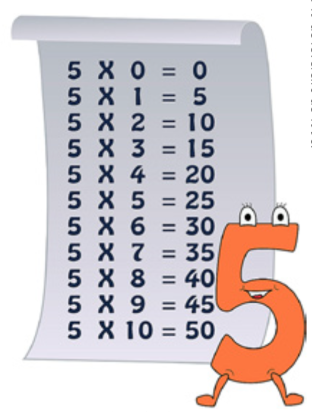

# <a name="estruturas-de-repeticao">Estruturas de repetição</a>

Ao desenvolver algoritmos muitas vezes nos deparamos com situações
em que precisamos repetir um determinado trecho de código ou todo
o código um certo número de vezes. Por exemplo, se queremos
efetuar a soma dos 100 primeiros números pares, somar n números
enquanto o valor da soma não ultrapasse 500, calcular a média de
20 números, calcular a tabuada de um número, somar os números
entre uma faixa de valores, efetuar um processamento enquanto o
usuário informe "SIM", validar um dado de entrada e outras.

Nos casos descritos acima e em muitos outros, podemos criar um loop
para efetuar o processamento de um trecho de código quantas vezes
forem necessárias. Essas estruturas de repetição (loop) são,
também, denominadas de laços de repetição e malhas de repetição.

Nas estruturas de repetição o número de repetições pode ser
fixo ou estar relacionado a uma condição. Isto é, os laços de
repetição podem ser classificados em laços contados e laços
condicionais.

Os laços contados são aqueles que utilizamos quando sabemos
previamente quantas vezes o trecho do código precisa ser repetido.
Por exemplo, realizar a leitura de 100 números, efetuar o
somatório dos números entre 500 e 700 e outros. A estrutura
utilizada para representar os laços contados é a **Estrutura Para**.

Os laços condicionais são utilizados quando não conhecemos o
número de vezes que o trecho de código precisa ser repetido. A
repetição está atrelada a uma condição que pode ser alterada
dentro do laço. Por exemplo, solicitar que o usuário informe um
número até que ele digite um número entre 1 e 12. Utilizando
laços podemos "forçar" a digitação de um dado de entrada válido,
ou seja, enquanto o usuário não digitar um número dentro da faixa
definida continuamos solicitando que ele informe um número.

Os laços condicionais podem ter o teste lógico no início ou no
final do laço, configurando assim duas estruturas de repetição:
**Estrutura Repita** e **Estrutura Enquanto**.

No uso de estruturas de repetição observaremos que é necessário
utilizar variáveis contadoras e acumuladoras. Uma variável
contadora é uma variável que recebe um valor inicial antes de
iniciar a estrutura de repetição e no interior dessa estrutura
seu valor é incrementado em um valor constante. Já uma variável
acumuladora é uma variável que recebe um valor inicial antes do
início de uma estrutura de repetição e é incrementada no
interior dessa estrutura em um valor variável. O que difere uma
variável contadora de uma acumuladora é o valor que elas são
incrementadas na estrutura de repetição. Em uma variável
contadora o valor é fixo e em uma variável acumuladora o valor é
constante.

## Índice

- [Estruturas de repetição](#estruturas-de-repeticao)
	- [Estrutura para](#estrutura-para)
	- [Estrutura enquanto](#estrutura-enquanto)
	- [Estrutura repita](#estrutura-repita)
	- [Exercícios](#exercicios)

## <a name="estrutura-para">Estrutura para</a>

A estrutura Para é uma estrutura do tipo laço contado, utilizada
para um número definido de repetições. Isto é, devemos utilizar
essa estrutura quando sabemos o número de vezes que o trecho de
código precisa ser repetido. Outro termo utilizado para essa
estrutura de repetição é o de estrutura de repetição com
variável de controle, pois é utilizada uma variável contadora
para controlar o número de repetições. A sintaxe da estrutura
Para é:

```
para <variável> de <início> ate <fim> passo <incremento> faca

	<instruções>

fimpara
```

Em que:

- `<variável>`: é a variável contadora utilizada para controlar a
 estrutura de repetição. Esta variável tem que ser do tipo inteiro.

- `<início>` e `<fim>`: esses termos delimitam o intervalo para a
execução do laço de repetição. Podem ser constantes inteiras,
funções ou expressões que retornem números inteiros.

- `<incremento>` representa o valor que será incrementado ou
decrementado (se for um valor negativo) a cada passagem do laço,
isto é, como será a variação da variável de controle (contador).

- Esse termo pode ser representado por uma constante ou uma variável.

O número de repetições do bloco de comandos é igual ao número
de termos da série delimitada pelos termos `<início>` e `<fim>`. A
variável contadora não deve aparecer em um comando de leitura
dentro do bloco de repetição.

Agora que você conheceu a teoria sobre a estrutura de repetição
para, vamos resolver um problema utilizando-a para tornar mais clara
a sua aplicação prática. Você se lembra da tabuada? A abaixo
apresenta a tabuada para o número 5, em que temos o produto entre o
número 5 e os números compreendidos entre 0 e 10.



Que tal construir um algoritmo para efetuar a tabuada de um número
qualquer?

> **Objetivo do algoritmo:** calcular a tabuada de um número inteiro.
>
> **Entrada:** obter um número inteiro.
>
> **Processamento:** efetuar a operação de multiplicação do
> número nformado pelos valores compreendidos entre 1 e 10.
>
> **Saída:** imprimir a tabuada de 1 a 10 do número informado na entrada.

Na entrada de dados temos que ler um número inteiro, isto implica
que precisamos declarar uma variável do tipo inteira para armazenar
o número digitado pelo usuário. Denominaremos essa variável de
`num`.

O processamento consiste em multiplicar o número recebido na
entrada (armazenado na variável num) pelos valores 0, 1, 2, 3, 4, 5,
6, 7, 8, 9 e 10. Criaremos uma variável chamada `mult` para armazenar
o resultado da multiplicação. Observe que temos a
repetição de uma expressão aritmética de multiplicação (num x i),
em que sabemos previamente o número de repetições. Portanto, podemos
utilizar a estrutura Para. Lembre-se que ao utilizar esta estrutura
precisamos declarar uma variável contadora que deve ser do tipo inteiro,
nomearemos de `i`. A variável `i` deve ter início em 0 e fim em 10, pois
queremos mostrar a tabuada de 0 a 10. O passo a ser utilizado é 1. Como
 saída do algoritmo temos que imprimir o resultado da operação de multiplicação.

Observe que tanto o processamento (expressão aritmética dada por
`mult <- num * i`) quanto a saída de dados ( `Escreva(num, "x", i, "=", mult)` )
se encontram dentro do laço de repetição. Por que isso acontece? Pois,
temos que imprimir o resultado de 10 operações
de multiplicação e não apenas uma.

Lembre-se que um laço de repetição pode ser utilizado tanto para
entrada, processamento, quanto para a saída de dados.

```
Algoritmo "tabuada"
  Var
    Num, i, mult: inteiro

  Inicio

    Escreva("Digite um número:")
    Leia(num)

    para i de 1 ate 10 passo 1 faca

      mult <- num * i
      Escreva(num, "x", i, "=", mult)

    fimpara

Fimalgoritmo
```

Podemos melhorar o algoritmo construído para a tabuada? Sim,
podemos economizar uma variável, no caso a variável `mult`, e com isto,
retirar a instrução de atribuição, realizando a operação
aritmética diretamente no comando escreva. Isto é possível, pois
no comando escreva podemos colocar uma expressão.

```
Algoritmo "tabuada"
  Var
    Num, i: inteiro

  Inicio

    Escreva("Digite um número:")
    Leia(num)

    para i de 1 ate 10 passo 1 faca

      Escreva(num, "x", i, "=", num * i)

    fimpara

Fimalgoritmo
```

Nesta seção estudamos a estrutura de repetição controlada, que
utiliza uma variável contadora para controlar o laço. Essa
estrutura deve ser utilizada nas situações em que sabemos
previamente quantas vezes o comando deve ser repetido.

# <a name="estrutura-enquanto">Estrutura enquanto</a>

A estrutura Enquanto é uma estrutura do tipo laço condicional,
isto é, o loop baseia-se na análise de uma condição. Essa
estrutura é utilizada quando temos um número indefinido de
repetições e se caracteriza por realizar um teste condicional no
início.

A sintaxe da estrutura Enquanto é:

```
enquanto <condição> faca

  <instruções>

fimenquanto
```

Na estrutura **para** tínhamos uma variável de controle (contador)
para controlar o número de repetições do algoritmo. Na estrutura
**Enquanto** não há variável de controle, sendo imposta uma
condição para controlar a repetição do algoritmo. Devemos tomar
cuidado para garantir que em algum momento a condição será
satisfeita, senão o algoritmo pode entrar em loop (não parar nunca).

Outra situação é que como o teste condicional é executado no
início, podem ocorrer casos em que as instruções da estrutura de
repetição nunca sejam executadas. Isso acontece quando o teste
condicional da estrutura resulta em falso logo na primeira comparação.

Agora que conhecemos os conceitos relacionados à estrutura enquanto,
vamos construir um algoritmo para o seguinte problema: ler vários
números e informar quantos se encontram no intervalo de 100 a 300. Se
for digitado o valor 0, o algoritmo encerra sua execução.

> **Objetivo do algoritmo:** ler vários números e informar quantos
> estão no intervalo entre 100 e 300.
>
> **Entrada:** ler números inteiros até que seja digitado o
> número zero.
>
> **Processamento:** contar quantos números estão no intervalo
> entre 100 e 300.
>
> **Saída:** imprimir a quantidade de números entre 100 e 300.

Na entrada de dados temos que realizar a leitura de números
inteiros repetidas vezes, até que o valor zero seja digitado. O
processamento consiste em contar a quantidade de número que estão
na faixa entre 100 e 300, para isso utilizaremos uma variável do
tipo contador, que nomearemos como `cont`. Para saber quantos
valores estão dentro da faixa utilizaremos a estrutura condicional
`Se`. Como saída temos que informar o valor da variável `cont`.

Na construção de algoritmos utilizando a estrutura enquanto temos
que o teste lógico é realizado no início, deste modo precisamos
ter um valor atribuído para a variável usada na condição antes
de entrar na estrutura enquanto. Além disso, no conjunto de
instruções dentro do laço de repetição deve haver uma
instrução que modifique o valor dessa variável, senão entraremos
em um loop. Isto nos indica que ao utilizar laços do tipo enquanto
temos que ler a variável fora da estrutura de repetição e
dentro.

```
Algoritmo "conta"
  Var
    Num, cont: inteiro

  Inicio

    Escreva("Digite um número:")
    Leia(num)

    cont <- 0

    enquanto (num <> 0) faca

      Se (num >=100) E (num <=300) entao
        cont <- cont + 1
      fimse

      Escreva("Digite um número:")
      Leia(num)

    fimenquanto

    Escreva("A quantidade de números entre 100 e 300 é:", cont)

Fimalgoritmo
```

Vamos analisar este algoritmo linha a linha a partir da instrução
de `Inicio`. Temos um comando `escreva`, que envia uma mensagem ao
usuário que digite um número. O número digitado pelo usuário é
armazenado na variável `num` (comando `Leia`). Em seguida, temos
uma atribuição a variável `cont`, que é um contador. Por quê?
Sempre que utilizamos variáveis desse tipo devemos inicializá-la,
pois uma variável é um espaço de memória e pode conter "lixos".
Portanto, sempre inicialize as variáveis que exercem função de
contador e acumulador.

A próxima linha é a instrução enquanto em que temos o teste
lógico que analisa se o número é diferente de 0. Se o resultado
for verdadeiro, temos a execução das instruções que estão
dentro do laço, senão vai para a instrução após o
`fimenquanto`. No laço de repetição temos a verificação se o
número está ou não na faixa estabelecida. Para isso é usada a
estrutura condicional `Se`, em que temos duas expressões
relacionais unidas por uma expressão lógica com o operador `E`.
Se o resultado do teste lógico for verdadeiro temos que `cont` recebe
o valor que ele tem mais um, ou seja, é incrementado em uma
unidade. Se o teste lógico resultar em falso a execução segue
para a linha posterior ao `fimse`. Note que após o `fimse` temos a
leitura da variável novamente. Por que isso acontece? Se a leitura
da variável fosse realizada apenas fora do laço de repetição
teríamos que o laço entraria em loop, uma vez que teríamos o
mesmo valor para `num`. As instruções dentro do laço serão
repetidas até que na entrada seja obtido o valor zero. Quando este
valor for obtido tem-se a execução do comando após o
`fimenquanto`, que exibe na tela o valor armazenado na variável `cont`.

Vamos analisar o comportamento do algoritmo sem a entrada de dados
dentro da estrutura de repetição. Note que a leitura está sendo
realizada apenas antes da estrutura de repetição.

```
Algoritmo "conta"
  Var
    Num, cont: inteiro

  Inicio

    Escreva("Digite um número:")
    Leia(num)

    cont <- 0

    enquanto (num <> 0) faca

      Se (num >=100) E (num <=300) entao
        cont <- cont + 1
      fimse

    fimenquanto

    Escreva("A quantidade de números entre 100 e 300 é:", cont)

Fimalgoritmo
```

> Lembre-se!!! SEMPRE que você utilizar uma estrutura de
> desta repetição condicio-nal tem que ter uma instrução no
> interior estrutura que modifique o valor da variável que é
> utilizada no teste lógico. Variáveis contadoras e acumuladoras
> precisam ser inicializadas no início do código.

## <a name="estrutura-repita">Estrutura repita</a>

A estrutura Repita é uma estrutura do tipo laço condicional, isto
é, o loop baseia-se na análise de uma condição. Essa estrutura
é utilizada quando temos um número indefinido de repetições e
precisamos que o teste condicional seja realizado após a execução
do trecho de código. Isto é, devemos utilizar essa estrutura
quando não sabemos o número de vezes que um trecho do código deve
ser repetido.

A sintaxe da estrutura Repita é:

```
Repita
  <instruções>
ate <condição>
```

Observe que na estrutura Repita as instruções dentro do laço
serão executadas pelo menos uma vez, pois a análise condicional é
executada ao final. Do mesmo modo que na estrutura condicional
enquanto, lembre-se que nas instruções que estão dentro da
estrutura de repetição tem que haver uma instrução que altere o
valor da `<condicao>`.

Com o conhecimento que temos sobre a estrutura Repita vamos
reescrever o algoritmo que lê vários números e informa quantos
estão no intervalo de 100 a 300. Se for digitado o valor 0, o
algoritmo encerra sua execução. Descrevemos os passos da
estruturação deste problema no tópico "ESTRUTURA ENQUANTO".

```
Algoritmo "conta"
  Var
    Num, cont: inteiro

  Inicio

    cont <- 0

    repita

      Escreva("Digite um número:")
      Leia(num)

      Se (num >=100) E (num <=300) entao
        cont <- cont + 1
      fimse

    ate (num = 0)

    Escreva("A quantidade de números entre 100 e 300 é:", cont)

Fimalgoritmo
```

Vamos estudar cada linha do algoritmo para entender melhor o
funcionamento dessa estruturação de repetição. Na primeira linha
temos a inicialização da variável `cont`, que conta o número de
valores que estão na faixa entre 100 e 300. Afinal, por que
inicializamos essa variável? Por exemplo, se efetuamos a leitura de
vários números e nenhum deles estava na faixa entre 100 e 300,
qual o valor de `cont`? Não há como garantir que o valor será
zero. Como uma variável é um espaço em memória, devemos inicializá-lo
para que não fique nenhum "lixo".

Após a inicialização de `cont`, temos o início da estrutura
Repita. Internamente a essa estrutura temos a leitura do número, o
qual é armazenado na variável `num`. Em seguida, temos a estrutura
condicional `se`, que analisa se o número é maior ou igual a 100 e
menor ou igual a 300. O resultado do teste lógico é verdadeiro quando
as duas expressões relacionais são verdadeiras e então `cont` é
incrementado em 1. Se o resultado do teste for falso vai
diretamente para a linha que impõe a condição para o laço de
repetição. Nesta linha, temos a verificação se o número é
igual a zero, isto é, quando o número for igual a zero, a
repetição do laço finaliza e é executada a instrução escreva.

Observe que na estrutura Repita a leitura da variável é realizada
internamente. Isso acontece porque o teste lógico é executado no
final. Deste modo, o conjunto de instruções que estão dentro do
laço é executada uma ou mais vezes. Na estrutura enquanto o
conjunto de instruções pode não ser executado, pois o teste
lógico é realizado no início.

# <a name="exercicios">Exercícios</a>

1. Escreva um algoritmo que leia o número de vezes que se deseja imprimir a palavra "ALGORITMOS" e imprimir.

1. Elabore um algoritmo que leia cem números inteiros e conte quantos são pares e quantos são ímpares.

1. Construa um algoritmo que entre com números inteiros enquanto forem positivos e imprima quantos números foram digitados.

1. Faça um algoritmo que calcula a área de um triângulo e que não permita a entrada de dados inválidos, ou seja, as medidas devem ser maiores ou iguais a zero.

1. Construa um algoritmo que leia números inteiros até que seja digitado um valor negativo. Ao final, informe a média dos números, o maior e o menor valor.

1. Apresente todos os números divisíveis por 5 que sejam menores que 200 e maiores do que 15.

1. Escreva um algoritmo que leia 20 nomes e imprima o primeiro caractere de cada nome.

1. Formule um algoritmo que entre com o nome do aluno e as notas de quatro provas de 5 alunos. Imprima nome, nota1, nota2, nota3, nota4 e média de cada aluno e informe a média geral da turma.

1. Construa um algoritmo que leia números inteiros até que seja digitado o 0. Calcule e escreva o número de valores lidos, a média aritmética, a quantidade de números pares e a quantidade de números ímpares.

1. Elabore uma algoritmo que imprima todas as tabuadas do 1 ao 10.
